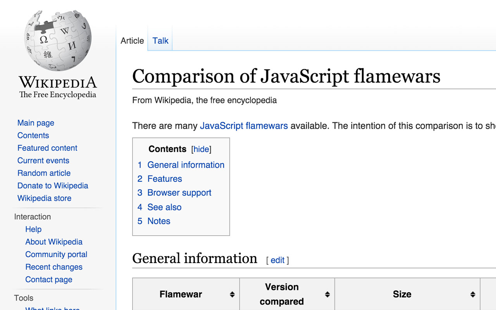

# Replace “Frameworks” with “Flamewars”

Chrome Extension that contains just a simple content script that replaces “`frameworks`” with “`flamewars`” on any page.

See [Tweet](https://twitter.com/molily/status/671971189103964160) from  [@molily](https://github.com/molily):

> Take an article on JavaScript, replace “frameworks” with “flamewars”: Suddenly it makes sense. https://t.co/q6cV7D4qmO

## Install

Available in the [Chrome Webstore](https://chrome.google.com/webstore/detail/replace-%E2%80%9Cframeworks%E2%80%9D-with/dmnlnjijflgoaelbmcgdibcgoniajabm)

## License

MIT © [Michael Kühnel](http://michael-kuehnel.de)
